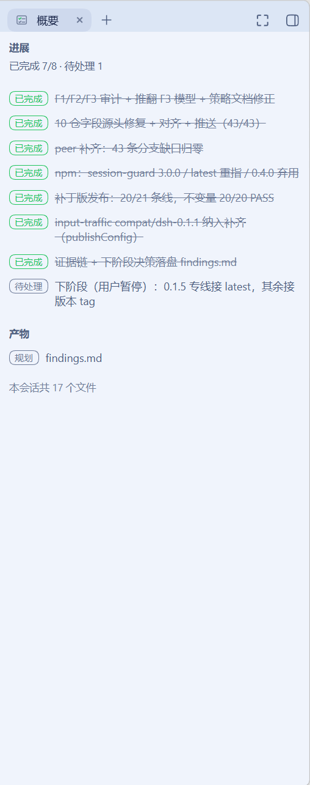

# dsh-brief-sidebar

[简体中文](README.md) | [Français](README.fr.md) | [Deutsch](README.de.md) | [Italiano](README.it.md) | [Русский](README.ru.md) | [Español](README.es.md)

DSH-Web-Plugin (Verbraucher von `dsh-better-sidebar`), Repo-/Paketname **`dsh-brief-sidebar`** (Sitzungs-Briefing-Seitenleiste).
Es rendet das **Briefing („brief“)** der Sitzung als Tab „Übersicht“ in der rechten Seitenleiste; das Briefing besteht aus zwei Listen:

- **todo-Liste** — das **Fortschritts**-Board der `todos`-Projektion, das die drei Zustände und die Fortschrittszusammenfassung der Aufgaben der aktuellen Sitzung zeigt;
- **Deliverables-Liste** — der **Deliverables**-Abschnitt der `dshSummaryDeliverables`-Projektion, der im Turn in Echtzeit die erfolgreich geschriebenen/geänderten Dateien zeigt;
  codeplan-Planungsdeliverables werden inline mit einer „Planung“-Pill markiert.

Gleichzeitig **überdeckt** es das offizielle DSH-todo-Panel über dem composer, sodass das Board der einzige sichtbare Träger der Todos wird.

Rein lesende Anzeige: kein Editieren, kein Zurückschreiben, keine Multi-Session-Aggregation, keine Kopie einer Drittanbieter-Renderingschicht.

**Kompatibilitätsbereich (aktuell)**: Es wird nur die **DSH-0.2.0-Linie** unterstützt — `engines.dsh` ist `>=0.2.0-rc.1 <0.2.1-0`, getestete Basis ist DSH 0.2.0-rc.1 (diese Linie, Zweig `main`, befördert aus `compat/0.2.0`); die 0.1.x-Linie (0.1.5/0.1.7) wird weiter von den eingefrorenen Zweigen `compat/0.1.7` / `compat/0.1.5` (≤0.3.1) versorgt.
Host-Linien 0.1.2 und älter sind **nicht im Supportumfang**, und npm hat keinen entsprechenden dist-tag (die Veröffentlichungen der 0.2.0-Linie dieses Pakets laufen über `dsh-0.2.0`).



**Namensgrenze**: Die Identität dieses Plugins (Paketname / Plugin-ID / cordis-Bundle-ID / Locale-Namespace / DOM-Hook
`data-dsh-brief-sidebar`) verwendet durchweg `brief`; die `todos`-Projektion, das `todo_write`-Tool, die offizielle dock cell `{ id: 'todo' }` und `dsh-tool-todo` gehören dagegen zur DSH-Upstream-Domäne — der Originalbegriff `todo` bleibt erhalten, das Plugin benennt nichts um.

**Gedächtnissystem**: Der dritte Abschnitt des Briefings (Memory-Recall) ist derzeit nur ein **reservierter Layout-Slot**, befindet sich **in Planung** und wird in dieser Version nicht gerendert — siehe R11 / K4.

## Anforderungsmapping

| Nr. | Anforderung | Implementierungsort |
|---|---|---|
| R1 | Während des Plugin-Mountens wird die offizielle todo-Leiste überhaupt nicht gerendert | `src/client/brief/dock-shadow.tsx` |
| R2 | Eigenständiges Plugin, das den Tab „Übersicht“ bei better-sidebar registriert | `src/client/index.tsx` |
| R3 | Daten stammen ausschließlich aus der vom Host berechneten `todos`-Projektion; keine clientseitige Zusammenführung, kein Zurückschreiben | `src/client/brief/use-todos.ts` + `board.ts` |
| R4 | Gewöhnliches React + `--dsw-alias-*`-Tokens; null Code-/Namensbeziehung zum Canvas-Plugin | `src/client/TodoBoardTab.tsx` (TodoSection) + `BriefIcon.tsx` |
| R5 | Reversibel: Nach Deaktivierung/Deinstallation des Plugins stellt sich der offizielle dock automatisch wieder her | Alle Registrierungen laufen über `ctx.effect`, die Disposer werden mit der fiber eingesammelt |
| R6 | Nicht destruktiv: keine Änderung am DSH-Checkout / better-sidebar / Canvas-Plugin | Dieses Paket trägt sich selbst, keine der genannten Repos wird berührt |
| R7 | Der Tab wird zu „Übersicht“ hochgestuft, `TAB_ID` unverändert (Ersatz an Ort und Stelle, bereits geöffnete Tabs bleiben verbunden) | `src/client/SummaryTab.tsx` + `index.tsx` |
| R8 | Abschnitt 1 „Fortschritt“: der Drei-Zustände-Vertrag von todos wird auf Abschnittsebene abgesenkt | `src/client/TodoBoardTab.tsx` |
| R9 | Abschnitt 2 „Deliverables“: Echtzeitliste des letzten Turns + Sitzungskumulation; die Host-Hälfte registriert die Projektion | `src/projection/*` + `src/client/summary/*` |
| R10 | codeplan-Deliverables sind eine annotierte Teilmenge des Deliverables-Abschnitts (Inline-„Planung“-Pill), kein eigenständiger Abschnitt | `src/client/summary/deliverables.ts` + `DeliverablesSection.tsx` |
| R11 | Memory-Recall: nur reservierter Layout-Slot (ganz unten in der Abschnittsfolge), **in Planung**, wird in dieser Version nicht gerendert | Slot-Kommentar in `src/client/SummaryTab.tsx` / K4 |
| R12 | Verhaltensbewahrung: Überdeckung, badge, `visible`-Pause, Höhenvertrag, 0.1.5-Adaption | An verschiedenen Stellen, siehe unten |
| R13 | Die Host-Hälfte macht keine synchrone I/O; die Projektion ist ein optionaler Beitrag (Warten via `ctx.inject`) | `src/index.ts` + `src/projection/register.ts` |

## Installation

```powershell
# Die Veröffentlichungen der 0.2.0-Linie laufen über den dist-tag dsh-0.2.0 (die 0.1.x-Linie wird von den alten Versionen auf compat/0.1.7 / compat/0.1.5 weiter versorgt)
dsh plugin --profile web add dsh-brief-sidebar@dsh-0.2.0
# Alternative 1: lokales Tarball
dsh plugin --profile web add <dsh-brief-sidebar-0.4.0.tgz>
# Alternative 2: direkte Installation aus GitHub (Build in Eigenregie)
dsh plugin --profile web add github:drscrewdriver/dsh-brief-sidebar#main
```

`--profile` muss unmittelbar auf `plugin` folgen. Nach der Installation `http://127.0.0.1:3080` neu laden.

## Designpunkte

### Datenkette: die Projektions-Face direkt auflösen statt des `useProjection` des Frameworks

Der Tab-Körper von better-sidebar **befindet sich nicht im DSH-Slot-Baum** und bekommt die standardmäßigen Props im Session-Scope nicht; daher:

```ts
ctx.get('sessions')                                  // sicherer Zugriff (kein direktes Proxy-Lesen)
  ?.binding(scope.sessionId)?.session.projections    // SessionBinding.session = SessionFace
  ?.faceOf(key)                                      // ProjectionsFace
=> useSyncExternalStore(...)                         // kein lokaler Spiegel, keine Zusammenführung
```

Diese Kette wird von beiden Projektionen geteilt (`src/client/use-projection.ts` ist die key-unabhängige generische Auflösung):

- `todos` — von `dsh-tool-todo` registriert, der Host ist der einzige Berechnungspunkt, `TodoItem[] | null`.
- `dshSummaryDeliverables` — von der Host-Hälfte dieses Plugins registriert (siehe nächster Abschnitt), `DeliverablesView`.

**Die drei Zustände des Fortschritts-Abschnitts müssen unterscheidbar bleiben** (Vertrag von `readTodos`, durch Tests verriegelt):

| Wert | Bedeutung | Rendering |
|---|---|---|
| `undefined` | Fähigkeit fehlt (keine Sitzung / Host-Unit nicht montiert / noch keine baseline) | „Aufgaben derzeit nicht verfügbar“ |
| `null` → `[]` | Projektion vorhanden und leer | leerer Zustand |
| Array | echte Einträge | Liste + Fortschrittszusammenfassung |

Die ersten beiden zu vermischen, behauptet gegenüber dem Leser „diese Sitzung hat keine Aufgaben“, obwohl die Realität „Daten nicht abrufbar“ lautet.

Der Deliverables-Abschnitt ist anders: Er ist eine **optionale Erweiterungsfähigkeit**; fehlt die Projektion (die Host-Hälfte hat diese unit nicht registriert), wird der ganze Abschnitt ausgeblendet, ohne „nicht verfügbar“-Rauschen zu rendern; ist die Projektion da, sind `latest: null` und `sessionTotal: 0` sein leerer Zustand (die unit publiziert ab Registrierung).

### Deliverables-Datenkette: die Host-Hälfte registriert eine Projektions-unit

Die Daten der offiziellen „Ergebnis dieses Turns“-Zeile (`ui-deliverables`) akkumulieren im Turn bereits eintragsweise mit jedem erfolgreichen `tool/result`; nur hängt die offizielle UI an `conversation.chat.turnTail` und rendert erst am Turn-Ende, während der Sidebar-Tab an die Turn-Daten der Conversation-Engine nicht herankommt (`SessionFace` legt das Ereignisfenster nicht offen, `IConversation` legt die Turn-Daten nicht offen). Deshalb trägt die Host-Hälfte dieses Plugins ihre eigene unit über `ctx.sessionProjections.register()` bei:

- Das **fold-Kriterium** ist deckungsgleich mit dem offiziellen `turn-deliverables.ts`: nur Pfade erfolgreicher `write` / `edit` /
  `str_replace_editor` (Varianten create/str_replace/insert) zählen, dedupliziert, Fehlschläge zählen nicht, Leseoperationen zählen nicht;
  im Turn erst schreiben dann ändern zählt als ein Eintrag (`src/projection/deliverables-fold.ts`, reine Funktion, durch Tests verriegelt).
- **Echtzeit im Turn**: jedes Commit-Ereignis der registry treibt das `apply` aller units; jede erfolgreich festgemachte Dateiänderung schiebt sofort eine Frame.
- **Optionaler Beitrag**: `ctx.inject(['sessionProjections'], …)` wartet auf den Service; ein Deployment ohne registry lädt dieses Plugin ganz normal
  (der Deliverables-Abschnitt blendet sich still aus); die Registrierung ist ein effect — bei Deinstallation verschwindet der key, und der Client liest „Fähigkeit fehlt“.
- **Kapazität**: Pfade des letzten Turns cap 50, Sitzungskumulation cap 100 (die neuesten bleiben erhalten); `sessionTotal` hat kein Limit,
  die Kumulationszeile „N Dateien insgesamt in dieser Sitzung“ bleibt stets wahrheitsgemäß.
- **key mit Namespace** (`dshSummaryDeliverables`): die registry verweigert das Teilen desselben key mit anderem `stateVersion`,
  um eine harte Kollision mit einer möglichen künftigen offiziellen Host-Projektion zu vermeiden.

### codeplan-Deliverables: annotierte Teilmenge des Deliverables-Abschnitts

Das **Kriterium der „Planung“-Pill ist eine reine Pfadregel**: trifft der Dateipfad des Ergebnisses nach Normalisierung der Trennzeichen auf das Segment `.agents/plans/` (Vor- und Rückwärtsstrich gleichermaßen), wird die „Planung“-Pill gesetzt und das erste Segment nach `.agents/plans/` (Aufgabenname) in `title` abgelegt.
Das Plugin liest keine Dateiinhalte und prüft nicht, ob der Schreiber das codeplan-Skill ist — jede Datei, die in dieses Verzeichnis geschrieben wird, wird markiert;
der Vorteil dieses Kriteriums ist die null zusätzliche Datenkette, der Preis ist, dass die Pfadkonvention selbst die einzige Wahrheitsquelle ist (siehe Lücke K5).

Das codeplan-Skill schreibt `spec.md` / `findings.md` / `checklist.md` / `tasks.md` per write unter
`$workspace\.agents\plans\<任务名>\` — diese Dateien erscheinen von selbst im Deliverables-fold, ohne zusätzliche Sammlung.
Planungs-Deliverables haben keinen eigenen Abschnitt: sie sind von Natur aus Teil der Deliverables.

### Klick-Öffnen: derselbe Sidebar-Vorschaukanal wie der Konversationsfluss

Im Deliverables-Abschnitt ist jede Pfadzeile ein Button; ein Klick geht über `ctx.sidebarRight.openResource(<address>)` — exakt derselbe Kanal wie die „Ergebnis dieses Turns“-chips im Chat und Inline-`code`-Erwähnungen (das Vorgehen von ui-chat `openFile`). Die Adresse konstruiert das inline portierte `fileAddressFor` (Quelle `@deepseek-ai/dsh-util-workspace-path`): relativer Pfad oder absoluter Pfad innerhalb des Sitzungsarbeitsbereichs, adressiert nach `dsh-resource://file/session/<id>/<相对路径>` (der Arbeitsbereichs-Präfix wird abgestreift); absolute Pfade außerhalb des Arbeitsbereichs behalten ihre absolute Schreibweise in derselben Sitzungsadresse. Das Sitzungs-cwd wird aus dem `sessions.list`-Snapshot gelesen, bei jedem Klick frisch.
Fehlt der `sidebarRight`-Service, degradieren die Zeilen zu reinem Text (dieselbe Degradierungsdisziplin wie bei fehlender Deliverables-Projektion).

### Überdecken des offiziellen docks: cell-Wettbewerb im list-Slot

`conversation.input.dock` ist ein **list-Slot**, cells werden über die `id` des Eintrags identifiziert. Das Verhalten von SlotCore:

1. Der Duplikatschlüssel von `register()` ist `(id, priority)` — dieselbe `id` mit anderer `priority` ist eine legale Registrierung;
2. Einträge werden nach aufsteigender `priority` (dann nach `order`) sortiert, der Fehlertext trägt selbst die Semantik "lowest renders";
3. `entriesOfSlot()` nimmt beim list-Slot die cells nach `options.id` und **behält pro cell nur den nach der Sortierung ersten Eintrag**.

Der offizielle Eintrag registriert `{ id: 'todo', order: 0 }` (priority-Default = 0); dieses Plugin gewinnt mit **`{ id: 'todo', priority: -1 }**.
Die Registrierung läuft über `ctx.slots.inject('conversation.input.dock', …)` (wartet auf die Slot-Deklaration und installiert sich bei deren Neuaufbau neu),
nicht über nacktes `register` (das mit der children-Deklarationstabelle des Parent-Eintrags in eine Race geriete). Dasselbe Vorgehen ist bei `dsh-input-traffic` gegenüber der Nachbar-cell `queue` bereits ein laufendes Präzedenzbeispiel.

**Nur überdecken, wenn `betterSidebar` verfügbar ist**, sonst wäre das Panel versteckt und die Aufgaben nirgends sichtbar.

### Trägerfläche: die native rechte Seitenleiste von DSH

Ab 0.1.5 gehört die rechte Seitenleiste DSH-nativ; das `openTab` von better-sidebar registriert mit dem Default `target: 'right'` den Inhalt als nativen Tab-Typ,
das `+`-Menü ist die native guide-Seite (`description` wird nur gerendert, wenn die guide-Seite ≤4 Einträge hat). Der Tab-Körper bekommt weiterhin
`TabComponentProps = { ctx, store, scope, tab, visible, … }`; dieses Plugin nutzt daraus nur `ctx` / `scope` / `visible`.

Bei `visible === false` wird die ganze Karte (inklusive Hülle) nicht gerendert, damit der versteckte Tab nicht bei jeder Projektions-Frame neu rendert.

## Kopplungsrisiken und Selbstprüfung

| Risiko | Folge | Selbstprüfmethode |
|---|---|---|
| Der Upstream benennt die `todo`-cell-id um | Überdeckung versagt still, das offizielle Panel taucht wieder auf (**fail-open**: Daten gehen nicht verloren, sie werden nur doppelt angezeigt) | In der Konsole `ctx.slots.entriesOfSlot('conversation.input.dock').filter(e => e.options.id === 'todo')` ausführen; übrig bleiben darf nur der Eintrag dieses Plugins (`registrant: 'dsh-brief-sidebar'`, `priority: -1`) |
| better-sidebar-Panel/Seitenleiste geschlossen | Aufgaben unsichtbar | Das Tab-badge zeigt die Anzahl unerledigter Aufgaben als Hinweis |
| Der Upstream ändert key oder Felder der `todos`-Projektion | Das Board zeigt „nicht verfügbar“ oder verwirft ungültige Einträge | `SessionProjectionMap.todos` in den `types.d.ts` von `dsh-tool-todo` bleibt die einzige Wahrheitsquelle |
| better-sidebar-API-Drift | Registrierungsfläche fällt aus | Nur die Grundfelder von `registerTab` verwenden (`id/title/description/icon/order/single/badge/component`); `peerDependencies` auf `>=0.18.1` gelockert, `devDependencies` auf die aktuell laufende Version gepinnt |
| Drift im offiziellen fold-Kriterium (neue Mutations-Tools kommen in die Liste usw.) | Die Deliverables-Liste dieses Plugins entfernt sich zunehmend vom offiziellen „Ergebnis dieses Turns“ | Als Ausrichtungsbasis des Kriteriums gilt der `mutationPath` von `ui-deliverables/turn-deliverables.ts`; bei jedem Upgrade einmal diffen |
| Der Upstream ändert die Form der `tool/call` / `tool/result`-Ereignisse | Der Deliverables-fold verliert Daten (`readTodos`-Art Verteidigung verengt sich, kein Absturz) | Die Einträge `'tool/call'` / `'tool/result'` im `SessionEventMap` von `dsh-session` sind die Wahrheitsquelle |

## Bekannte Lücken

- **K1** Deaktiviert der Nutzer diesen Tab-Typ in der Side-Karte, bleibt der dock versteckt → Aufgaben nirgends sichtbar.
  Später möglich: gate on `prefs.tabsEnabled`; diesmal nicht getan (der Nutzer hat „vollständig verstecken“ gewählt).
- **K2** better-sidebar-Panel/Seitenleiste geschlossen → Aufgaben unsichtbar (als akzeptiert bestätigt).
- **K3** Der Upstream benennt die `todo`-cell um → Überdeckung versagt still (fail-open, siehe Tabelle oben).
- **K4** Der Memory-Recall-Abschnitt hat nur einen Layout-Slot (**in Planung**): Das System hat kein Default-Gedächtnis; die Datenkette wird angedockt, sobald ein Gedächtnis-Plugin einen Projektions-key registriert.
- **K5** Die „Planung“-Pill ist eine reine Pfadpräfix-Entscheidung (Segment `.agents/plans/`) und prüft den Schreiber nicht: auch Dateien, die andere Quellen als codeplan in dieses Verzeichnis schreiben, werden markiert; wechselt codeplan seine Deliverables-Verzeichniskonvention, muss die Konstante in `summary/deliverables.ts` nachgezogen werden.
- **K6** Das Klick-Öffnen der Pfadzeilen hängt vom Host-Service `sidebarRight` ab (optionale Nutzung); auf Deployments ohne diesen Service sind die Deliverables-Zeilen nicht klickbar und werden nur als reiner Text angezeigt.

## Entwicklung

```powershell
pnpm install        # Abhängigkeiten: react / @deepseek-ai/cordis / zod als devDep, zur Laufzeit von der Host-Modultabelle geliefert oder mit dem Paket gebündelt
pnpm typecheck      # tsc -p tsconfig.json && tsc -p tsconfig.client.json
pnpm test           # vitest (jsdom)
pnpm build          # tsc erzeugt lib/types + tsdown erzeugt lib/index.mjs / lib/client.js (zod ins host-Paket gebündelt, in sich geschlossen)
npm pack            # erzeugt das Tarball (dieses Verzeichnis hat ein pnpm-workspace.yaml ohne packages-Feld, pnpm pack ist unbrauchbar)
```

`lib/` **muss eingecheckt sein**: Installiert das profile über eine GitHub-ref, gibt es keinen Build-Schritt.

## Kompatibilität

Die einzeln nachgetesteten Aufzeichnungen der 0.1.x-Linie stehen in den READMEs der Zweige `compat/0.1.7` / `compat/0.1.5` (≤0.3.1); diese Linie (`main`) zielt auf die **DSH-0.2.0-Linie**, getestete Basis ist **DSH 0.2.0-rc.1 + dsh-better-sidebar 0.19.1**.
0.2.0-rc.1 ist zur Plugin-API von 0.1.7 voll kompatibel (manifest/settings/HMR/slot/Sitzung V4 unangetastet); die gesamte konsumierte Fläche dieses Plugins besteht aus reinen `ctx.get(...)`-Aufrufern (`slots` / `locale` / `betterSidebar` / `sidebarRight` / `sessions`, mit eigenen lokalen Interface-Definitionen), ohne Override der Host-Verträge — diese Linie ist daher eine reine Metadaten-Adaption mit null Codeänderungen.
`engines.dsh` ist `>=0.2.0-rc.1 <0.2.1-0`, und die drei Stellen — `engines.dsh` in `package.json`, der DSH-Client-Paketbereich in `peerDependencies` und `engines.dsh` in `dsh.plugin.json` — **müssen übereinstimmen** (derzeit stimmig).
**Host-Linien ab 0.2.1 sind von dieser Linie nicht abgedeckt**: rc-Fenster-Pinning-Disziplin; ab 0.2.1 muss die Adaption neu bewertet werden (dann wird eine neue Versionslinie eröffnet).

## Sprachhinweise / Sprachen / Langues / Языки / Idiomas / Lingue

Das ursprüngliche README ist auf Chinesisch verfasst; dieses Dokument ist seine deutsche Übersetzung. Installations- und Kompatibilitätsüberblick (diese Linie erfordert DSH 0.2.0: `>=0.2.0-rc.1 <0.2.1-0`; Installation: `dsh plugin --profile web add dsh-brief-sidebar@dsh-0.2.0`):

- **Deutsch** — benötigt DSH 0.2.0 (`>=0.2.0-rc.1 <0.2.1-0`), getestet gegen DSH 0.2.0-rc.1. Installation: `dsh plugin --profile web add dsh-brief-sidebar@dsh-0.2.0`. Die 0.1.x-Wirtslinie wird von den eingefrorenen Zweigen `compat/0.1.7` / `compat/0.1.5` (npm-Tags `dsh-0.1.7` / `dsh-0.1.5`) versorgt.
- **Français** — nécessite DSH 0.2.0 (`>=0.2.0-rc.1 <0.2.1-0`), testé avec DSH 0.2.0-rc.1. Installation : `dsh plugin --profile web add dsh-brief-sidebar@dsh-0.2.0`. La lignée d'hôtes 0.1.x est assurée par les branches figées `compat/0.1.7` / `compat/0.1.5` (tags npm `dsh-0.1.7` / `dsh-0.1.5`).
- **Русский** — требуется DSH 0.2.0 (`>=0.2.0-rc.1 <0.2.1-0`), протестировано на DSH 0.2.0-rc.1. Установка: `dsh plugin --profile web add dsh-brief-sidebar@dsh-0.2.0`. Линия хостов 0.1.x обслуживается замороженными ветками `compat/0.1.7` / `compat/0.1.5` (npm-теги `dsh-0.1.7` / `dsh-0.1.5`).
- **Español** — requiere DSH 0.2.0 (`>=0.2.0-rc.1 <0.2.1-0`), probado con DSH 0.2.0-rc.1. Instalación: `dsh plugin --profile web add dsh-brief-sidebar@dsh-0.2.0`. La línea de anfitriones 0.1.x la atienden las ramas congeladas `compat/0.1.7` / `compat/0.1.5` (etiquetas npm `dsh-0.1.7` / `dsh-0.1.5`).
- **Italiano** — richiede DSH 0.2.0 (`>=0.2.0-rc.1 <0.2.1-0`), testato su DSH 0.2.0-rc.1. Installazione: `dsh plugin --profile web add dsh-brief-sidebar@dsh-0.2.0`. La linea di host 0.1.x è servita dai rami congelati `compat/0.1.7` / `compat/0.1.5` (tag npm `dsh-0.1.7` / `dsh-0.1.5`).
