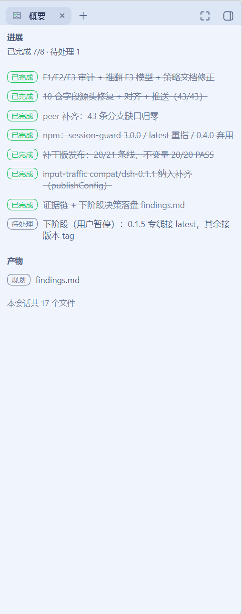

# dsh-brief-sidebar

DSH web 插件（`dsh-better-sidebar` 消费方），仓库/包名 **`dsh-brief-sidebar`**（会话简报侧栏）。
把会话的**简报（brief）**渲染成右侧栏里的一个「概要」tab，简报由两张列表构成：

- **todo 列表** —— `todos` 投影的**进展**看板，展示当前会话任务的三态与进度摘要；
- **产物列表** —— `dshSummaryDeliverables` 投影的**产物**分区，回合内实时展示成功写入/修改的文件，
  codeplan 规划产物以「规划」pill 行内标注。

同时**遮蔽** DSH 官方那条 composer 上方的 todo 面板，使看板成为 todo 的唯一可见载体。

只读展示：不做编辑、不做写回、不做多会话聚合、不复制任何第三方渲染层。



**命名边界**：本插件的身份标识（包名 / plugin id / cordis bundle id / locale 命名空间 / DOM 钩子
`data-dsh-brief-sidebar`）一律用 `brief`；而 `todos` 投影、`todo_write` 工具、官方 `{ id: 'todo' }`
dock cell、`dsh-tool-todo` 属于 DSH 上游领域，沿用 `todo` 原词，不随本插件改名。

**记忆系统**：简报的第三个分区（记忆召回）目前**仅预留布局插槽**，处于**规划中**，本期不渲染——见 R11 / K4。

## 需求映射

| 编号 | 需求 | 实现位置 |
|---|---|---|
| R1 | 插件挂载期间官方 todo 条完全不渲染 | `src/client/brief/dock-shadow.tsx` |
| R2 | 新建独立插件，向 better-sidebar 注册「概要」tab | `src/client/index.tsx` |
| R3 | 数据只来自 Host 计算的 `todos` 投影，无客户端折叠、无写回 | `src/client/brief/use-todos.ts` + `board.ts` |
| R4 | 普通 React + `--dsw-alias-*` token，与 Canvas 插件零代码/命名关系 | `src/client/TodoBoardTab.tsx`（TodoSection）+ `BriefIcon.tsx` |
| R5 | 可逆：插件禁用/卸载后官方 dock 自动恢复 | 所有注册都走 `ctx.effect`，disposer 随 fiber 回收 |
| R6 | 非破坏：不改 DSH checkout / better-sidebar / canvas 插件 | 本包自持，未触碰上述任何仓库 |
| R7 | tab 升级为「概要」，`TAB_ID` 不变（原位替换，已打开的 tab 不失联） | `src/client/SummaryTab.tsx` + `index.tsx` |
| R8 | 分区一「进展」：todos 三态契约下沉到分区级 | `src/client/TodoBoardTab.tsx` |
| R9 | 分区二「产物」：最新回合实时列表 + 会话累计汇总，host 半部注册投影 | `src/projection/*` + `src/client/summary/*` |
| R10 | codeplan 产物是产物分区的标注子集（行内「规划」pill），非独立分区 | `src/client/summary/deliverables.ts` + `DeliverablesSection.tsx` |
| R11 | 记忆召回：仅预留布局插槽（分区序列最底），**规划中**，本期不渲染 | `src/client/SummaryTab.tsx` 插槽注释 / K4 |
| R12 | 行为保持：遮蔽、badge、`visible` 暂停、高度契约、0.1.5 适配 | 各处，见下文 |
| R13 | host 半部不做同步 IO，投影为可选贡献（`ctx.inject` 等待） | `src/index.ts` + `src/projection/register.ts` |

## 安装

```powershell
# 推荐：从 npm 安装（跨版本按宿主 DSH 线选 dist-tag；本机 0.1.5-rc.2 用 dsh-0.1.5）
dsh plugin --profile web add dsh-brief-sidebar@dsh-0.1.5
# 备选一：本地 tarball
dsh plugin --profile web add <dsh-brief-sidebar-0.3.0.tgz>
# 备选二：GitHub 直装（需自行构建）
dsh plugin --profile web add github:drscrewdriver/dsh-brief-sidebar#main
```

`--profile` 必须紧跟 `plugin` 之后。安装后刷新 `http://127.0.0.1:3080`。

## 设计要点

### 数据链：直接解析投影面，而不是用框架的 `useProjection`

better-sidebar 的 tab 体**不在 DSH slot 树内**，拿不到 session 作用域的标准 props，因此改为：

```ts
ctx.get('sessions')                                  // 安全获取（不直读 Proxy）
  ?.binding(scope.sessionId)?.session.projections    // SessionBinding.session = SessionFace
  ?.faceOf(key)                                      // ProjectionsFace
=> useSyncExternalStore(...)                         // 无本地镜像、无折叠
```

这条链路被两个投影共用（`src/client/use-projection.ts` 是 key 无关的通用解析）：

- `todos` — 由 `dsh-tool-todo` 注册，宿主是唯一计算点，`TodoItem[] | null`。
- `dshSummaryDeliverables` — 由本插件 host 半部注册（见下节），`DeliverablesView`。

**进展分区的三态必须保持区分**（`readTodos` 的契约，测试已锁定）：

| 值 | 含义 | 渲染 |
|---|---|---|
| `undefined` | 能力缺席（无会话 / 宿主单元未挂载 / 尚无 baseline） | 「任务暂不可用」 |
| `null` → `[]` | 投影存在且为空 | 空态 |
| 数组 | 真实条目 | 列表 + 进度摘要 |

把前两者混同，等于向读者宣称「这个会话没有任务」，而事实是「拿不到数据」。

产物分区不同：它是**可选增强能力**，投影缺席（host 半部未注册该 unit）时分区整体隐藏，不渲染
「不可用」噪音；投影在而 `latest: null`、`sessionTotal: 0` 就是它的空态（unit 一注册即发布）。

### 产物数据链：host 半部注册投影 unit

官方「本次产出」行（`ui-deliverables`）的数据在回合内就随成功的 `tool/result` 逐条累积，只是官方
UI 挂在 `conversation.chat.turnTail` 上、只在回合尾渲染；而侧栏 tab 拿不到 conversation 引擎的
turn data（`SessionFace` 不暴露事件窗口，`IConversation` 不暴露回合数据）。所以本插件 host 半部
通过 `ctx.sessionProjections.register()` 贡献自己的 unit：

- **fold 口径**与官方 `turn-deliverables.ts` 完全一致：只认成功 `write` / `edit` /
  `str_replace_editor`（create/str_replace/insert 变体）的路径，去重、失败不计、读类不计；
  回合内先写后改只算一个条目（`src/projection/deliverables-fold.ts`，纯函数，测试锁定）。
- **回合内实时**：注册表每条提交事件驱动所有 unit 的 `apply`，每次成功的改动文件落定即推送一帧。
- **可选贡献**：`ctx.inject(['sessionProjections'], …)` 等待服务，注册表缺席的部署照常加载本插件
  （产物分区静默隐藏）；注册是 effect，卸载即 key 消失、客户端读作能力缺席。
- **容量**：最新回合路径 cap 50、会话累计 cap 100（保最近）；`sessionTotal` 不设上限，累计行
  「本会话共 N 个文件」永远如实。
- **key 带命名空间**（`dshSummaryDeliverables`）：registry 拒绝同 key 不同 `stateVersion` 的共享，
  避免与官方未来可能的宿主投影硬撞。

### codeplan 产物：产物分区的标注子集

「规划」pill 的**判定依据是纯路径规则**：产出的文件路径归一化分隔符后命中 `.agents/plans/` 段
（正反斜杠均可），即标注「规划」pill 并把 `.agents/plans/` 后的第一段（任务名）放进 `title`。
插件不读文件内容、不校验写入者是不是 codeplan skill——任何写进该目录的文件都会带标；
这样判定的好处是零额外数据链，代价是路径约定本身是唯一的真源（见缺口 K5）。

codeplan skill 把 `spec.md` / `findings.md` / `checklist.md` / `tasks.md` 用 write 写到
`$workspace\.agents\plans\<任务名>\` 下——这些文件天然出现在产物 fold 里，无需额外采集。
规划产物没有独立分区：它本来就是产物的一部分。

### 点击打开：与对话流同一条 Sidebar 预览通道

产物分区里每个路径行是一个按钮，点击走 `ctx.sidebarRight.openResource(<address>)`——与对话里
「本次产出」chips、行内 `code` 提及完全同一条链路（ui-chat `openFile` 的做法）。地址由内联移植的
`fileAddressFor`（源 `@deepseek-ai/dsh-util-workspace-path`）构造：相对路径、或会话工作区内
的绝对路径，按 `dsh-resource://file/session/<id>/<相对路径>` 寻址（工作区前缀被剥掉）；工作区外的
绝对路径在同一会话地址里保留绝对拼写。会话 cwd 从 `sessions.list` 快照读取，每次点击时现读。
`sidebarRight` 服务缺席时行降级为纯文本（与产物投影缺席同一套降级纪律）。

### 遮蔽官方 dock：list 槽的 cell 竞争

`conversation.input.dock` 是 **list 槽**，cell 由条目的 `id` 标识。SlotCore 的行为是：

1. `register()` 判重键为 `(id, priority)` —— 同 id 换一个 priority 是合法注册；
2. 条目按 `priority` 升序（再按 `order`）排序，报错文案自带语义 "lowest renders"；
3. `entriesOfSlot()` 对 list 槽按 `options.id` 取 cell，**同 cell 只保留排序后的第一条**。

官方条目注册 `{ id: 'todo', order: 0 }`（priority 缺省 = 0），本插件以 **`{ id: 'todo', priority: -1 }** 胜出。
注册走 `ctx.slots.inject('conversation.input.dock', …)`（等待槽声明并在声明重建时重装），
而不是裸 `register`（会与父条目的 children 声明表竞态）。同一手法在 `dsh-input-traffic` 对兄弟 cell `queue`
上已是运行中的先例。

**仅在 `betterSidebar` 可用时才遮蔽**，否则藏了面板而任务无处可见。

### 承载面：DSH 原生右侧栏

0.1.5 起右侧栏归 DSH 原生所有，better-sidebar 的 `openTab` 默认 `target: 'right'` 会把内容注册为原生 tab 类型，
`+` 菜单即原生 guide 页（`description` 仅在 guide 条目 ≤4 个时渲染）。tab 体仍收到
`TabComponentProps = { ctx, store, scope, tab, visible, … }`，本插件只用其中 `ctx` / `scope` / `visible`。

`visible === false` 时整卡（含外壳）不渲染，避免隐藏 tab 每次投影帧重渲染。

## 耦合风险与自检

| 风险 | 后果 | 自检方法 |
|---|---|---|
| 上游重命名 `todo` cell id | 遮蔽静默失效，官方面板复现（**fail-open**：数据不丢，只是重复显示） | 控制台执行 `ctx.slots.entriesOfSlot('conversation.input.dock').filter(e => e.options.id === 'todo')`，应只剩本插件的条目（`registrant: 'dsh-brief-sidebar'`、`priority: -1`） |
| better-sidebar 面板/侧栏关闭 | 任务不可见 | tab badge 显示未完成数作为线索 |
| 上游改 `todos` 投影 key 或字段 | 看板显示「不可用」或丢弃非法条目 | `dsh-tool-todo` 的 `types.d.ts` 中 `SessionProjectionMap.todos` 仍是唯一真源 |
| better-sidebar API 漂移 | 注册面失效 | 只用 `registerTab` 的基本字段（`id/title/description/icon/order/single/badge/component`）；`peerDependencies` 放宽为 `>=0.18.1`，`devDependencies` 钉当前运行版 |
| 官方 fold 口径漂移（新变异工具入列等） | 本插件产物清单与官方「本次产出」渐行渐远 | 口径以 `ui-deliverables/turn-deliverables.ts` 的 `mutationPath` 为对齐基准，升级时 diff 一遍 |
| 上游改 `tool/call` / `tool/result` 事件形状 | 产物 fold 丢数据（`readTodos` 式防御收窄，不会崩） | `dsh-session` 的 `SessionEventMap` 中 `'tool/call'` / `'tool/result'` 条目是真源 |

## 已知缺口

- **K1** 用户在 Side 卡片里禁用本 tab 类型时，dock 仍处于隐藏态 → 任务无处可见。
  后续可 gate on `prefs.tabsEnabled`，本次不做（用户已选「完全隐藏」）。
- **K2** better-sidebar 面板/侧栏关闭时任务不可见（已确认接受）。
- **K3** 上游重命名 `todo` cell → 遮蔽静默失效（fail-open，见上表）。
- **K4** 记忆召回分区只有布局插槽（**规划中**）：系统无默认记忆，数据链等记忆类插件注册投影 key 后接入。
- **K5** 「规划」pill 是纯路径前缀判定（`.agents/plans/` 段），不校验写入者：非 codeplan 来源
  写进该目录的文件也会带标；codeplan 换产物目录约定时需同步 `summary/deliverables.ts` 的常量。
- **K6** 路径行点击打开依赖宿主 `sidebarRight` 服务（可选消费）；缺席的部署上产物行不可点击，
  仅纯文本展示。

## 开发

```powershell
pnpm install        # 依赖：react / @deepseek-ai/cordis / zod 为 devDep，运行时由宿主模块表提供或随包打包
pnpm typecheck      # tsc -p tsconfig.json && tsc -p tsconfig.client.json
pnpm test           # vitest（jsdom）
pnpm build          # tsc 出 lib/types + tsdown 出 lib/index.mjs / lib/client.js（zod 打进 host 包，自包含）
npm pack            # 出 tarball（本目录有 pnpm-workspace.yaml 但无 packages 字段，pnpm pack 不可用）
```

`lib/` **必须入库**：profile 通过 GitHub ref 安装时没有构建步骤。

## 兼容性

在 **DSH 0.1.5-rc.2 + dsh-better-sidebar 0.19.1** 上逐条实测（SlotCore 实现、官方 todo dock 注册点、
投影面类型、`sessionProjections.register` 契约、`registerTab` 契约均已读源码取证）。
`engines.dsh` 为 `>=0.1.5-rc.1 <0.2.0-0`。
